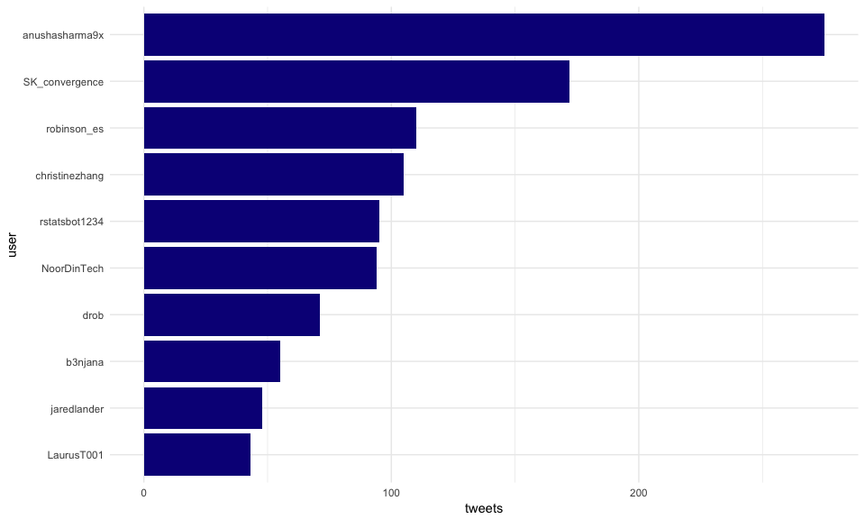
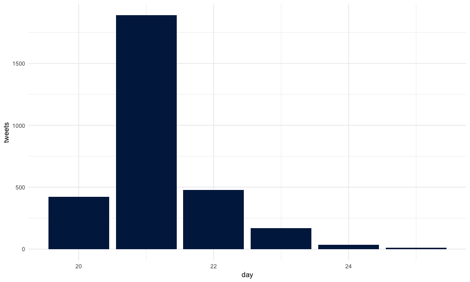

A search on Twitter, some R, and just enough Neo4J.


> Disclaimer: of course everything here could be done in pure R. But
> hey, where’s the fun in that?

> Disclaimer bis: this blogpost relies on {neo4r}, a package still under
> active development.

## Get the tweets

``` r
library(rtweet)
ny <- search_tweets("#rstatsnyc", n = 3000)
```

Tweets collected at `Sys.time()` == “2018-04-25 12:41:49 CEST”

``` r
nrow(ny)
```

    ## [1] 3000

I might not have everything here (as I’ve reached the limit of 3000
tweets), but let’s dive into this anyway.

## Prepare for Neo4J

Let’s get some info:

``` r
range(ny$created_at)
```

    ## [1] "2018-04-20 18:52:27 UTC" "2018-04-25 09:57:44 UTC"

Here, every tweet was sent in the same month of the same year, so we can
keep only the day.

``` r
library(dplyr)
ny <- ny %>% mutate(day = lubridate::day(created_at))
```

Also, as the `status_id` column is composed of large characters of 18
numbers, let’s recode this column:

``` r
library(forcats)
ny <- ny %>% mutate(status_id = fct_anon(as_factor(status_id)), 
                    status_id = as.character(status_id))
# Be sure we still have 3000 observations
length(unique(ny$status_id))
```

    ## [1] 3000

### The model

Here’s a model of the graph we want to create in Neo4J, made with
<http://www.apcjones.com/arrows>.


### Connect to Neo4J

``` r
library(neo4r)
con <- neo4j_api$new(url = "http://localhost:7474/", 
                     user = "neo4j", password = "pouetpouet")
# Is the connection working?
con$ping()
```

    ## [1] 200

### Create the CSV

Let’s create the CSV that will be sent to Neo4J. To do this, we need to:

  - Select the info
  - Write the csv in my Neo4J home
  - Send a query to Neo4J to retrieve and model these CSV

> Note: we’re working on a way to natively send csv with {neo4r}, so you
> won’t have to write in Neo4J home.

``` r
library(readr)
# CSV of tweets 
ny %>% 
  select(status_id, day, text, source, 
         lang, favorite_count, retweet_count, 
         is_quote, is_retweet) %>%
  write_csv("~/neo4j/import/ny_tweets.csv")

# CSV of users
ny %>% 
  select(status_id, screen_name) %>%
  write_csv("~/neo4j/import/ny_users.csv")

# CSV of hashtags
ny %>% 
  select(status_id, hashtags) %>%
  tidyr::unnest() %>% 
  na.omit() %>%
  write_csv("~/neo4j/import/ny_hastags.csv")

# CSV of mentions
ny %>% 
  select(status_id, mentions_screen_name) %>%
  tidyr::unnest() %>% 
  na.omit() %>%
  write_csv("~/neo4j/import/ny_mentions.csv")

# CSV of replies
ny %>% 
  select(status_id, reply_to_status_id) %>%
  na.omit() %>%
  write_csv("~/neo4j/import/ny_replies.csv")
```

Before reading the file in Neo4J, we should add some constraints to
ensure the nodes are unique. If you’re not familiar with this
terminology, a constraint is a property that will ensure that every
label is unique: for example, here, we will have to ensure that every
`status_id` is unique.

Hence, if we try to create a node with a `status_id` that already
exists, this writting process will fail (and that’s the reason why we
are using `MERGE` for writting the nodes with constraints).

``` r
'CREATE CONSTRAINT ON (t:Tweet) ASSERT t.name IS UNIQUE' %>%
  call_api(con)
```

    ## No data returned.

``` r
'CREATE CONSTRAINT ON (d:Day) ASSERT d.name IS UNIQUE' %>%
  call_api(con)
```

    ## No data returned.

``` r
'CREATE CONSTRAINT ON (u:User) ASSERT u.name IS UNIQUE' %>%
  call_api(con)
```

    ## No data returned.

``` r
'CREATE CONSTRAINT ON (h:Hashtag) ASSERT h.name IS UNIQUE' %>%
  call_api(con)
```

    ## No data returned.

> Note: the messages returned `## No data returned.` are due to the fact
> that we haven’t retrieved anything from the DB, neither stats about
> the call (which could be retrieved with the `include_stats` arguments)
> nor data.

Importing the csv to the DB:

  - With `include_stats = TRUE`:

<!-- end list -->

``` r
# Tweets but no day
'USING PERIODIC COMMIT 500
LOAD CSV WITH HEADERS FROM "file:///ny_tweets.csv" AS csvLine
MERGE (t:Tweet { name: csvLine.status_id, text: csvLine.text, source: csvLine.source, lang: csvLine.lang, favorite_count: toInteger(csvLine.favorite_count), retweet_count: toInteger(csvLine.retweet_count), is_quote: toBoolean(csvLine.is_quote), is_retweet: toBoolean(csvLine.is_retweet)});' %>%
  call_api(con, include_stats = TRUE)
```

    ## No data returned.

    ## # A tibble: 12 x 2
    ##    type                   value
    ##    <chr>                  <dbl>
    ##  1 contains_updates          1.
    ##  2 nodes_created          3000.
    ##  3 nodes_deleted             0.
    ##  4 properties_set        24000.
    ##  5 relationships_created     0.
    ##  6 relationship_deleted      0.
    ##  7 labels_added           3000.
    ##  8 labels_removed            0.
    ##  9 indexes_added             0.
    ## 10 indexes_removed           0.
    ## 11 constraints_added         0.
    ## 12 constraints_removed       0.

  - Without:

<!-- end list -->

``` r
# Days 
'USING PERIODIC COMMIT 500
LOAD CSV WITH HEADERS FROM "file:///ny_tweets.csv" AS csvLine
MERGE (d:Day {name : csvLine.day} )
WITH csvLine
MATCH (t:Tweet {name: csvLine.status_id})
MATCH (d:Day {name : csvLine.day} )
MERGE (t) -[:WAS_SENT]->(d);' %>%
  call_api(con)
```

    ## No data returned.

``` r
# Users
'USING PERIODIC COMMIT 500
LOAD CSV WITH HEADERS FROM "file:///ny_users.csv" AS csvLine
MERGE (u:User { name: csvLine.screen_name})
WITH csvLine
MATCH (u:User { name: csvLine.screen_name})
MATCH (t:Tweet {name : csvLine.status_id})
MERGE (u) -[:SENT]-> (t);' %>%
  call_api(con)
```

    ## No data returned.

``` r
# Hashtags
'USING PERIODIC COMMIT 500
LOAD CSV WITH HEADERS FROM "file:///ny_hastags.csv" AS csvLine
MERGE (h:Hashtag { name: csvLine.hashtags})
WITH csvLine
MATCH (t:Tweet {name : csvLine.status_id})
MATCH (h:Hashtag { name: csvLine.hashtags})
MERGE (t) -[:CONTAINS]-> (h);' %>%
  call_api(con)
```

    ## No data returned.

``` r
# Mentions
'USING PERIODIC COMMIT 500
LOAD CSV WITH HEADERS FROM "file:///ny_mentions.csv" AS csvLine
MERGE (m:User { name: csvLine.mentions_screen_name})
WITH csvLine
MATCH (t:Tweet {name : csvLine.status_id})
MATCH (m:User { name: csvLine.mentions_screen_name})
MERGE (t) -[:MENTIONS]-> (m);' %>%
  call_api(con)
```

    ## No data returned.

``` r
# Replies
'USING PERIODIC COMMIT 500
LOAD CSV WITH HEADERS FROM "file:///ny_replies.csv" AS csvLine
MERGE (t:Tweet { name: csvLine.reply_to_status_id})
WITH csvLine
MATCH (t:Tweet {name : csvLine.status_id})
MATCH (r:Tweet {name: csvLine.reply_to_status_id})
MERGE (t) -[:REPLIES_TO]-> (r);' %>%
  call_api(con)
```

    ## No data returned.

Let’s see what we’ve got:

``` r
con$get_constraints()
```

    ## # A tibble: 4 x 3
    ##   label   type       property_keys
    ##   <chr>   <chr>      <chr>        
    ## 1 User    UNIQUENESS name         
    ## 2 Hashtag UNIQUENESS name         
    ## 3 Tweet   UNIQUENESS name         
    ## 4 Day     UNIQUENESS name

``` r
con$get_labels()
```

    ## # A tibble: 4 x 1
    ##   labels 
    ##   <chr>  
    ## 1 Tweet  
    ## 2 User   
    ## 3 Hashtag
    ## 4 Day

``` r
con$get_relationships()
```

    ## # A tibble: 5 x 1
    ##   relationships
    ##   <chr>        
    ## 1 WAS_SENT     
    ## 2 SENT         
    ## 3 CONTAINS     
    ## 4 MENTIONS     
    ## 5 REPLIES_TO

## Let’s explore

### Check check

Let’s start with a check to see if we have everything:

``` r
# Have we got all the tweets?
length(unique(c(ny$status_id, ny$reply_to_status_id)))
```

    ## [1] 3041

``` r
'MATCH (t:Tweet) RETURN COUNT(t) AS tweets_count' %>%
  call_api(con)
```

    ## $tweets_count
    ## # A tibble: 1 x 1
    ##   value
    ##   <int>
    ## 1  3041

``` r
# Have we got all the Days?
length(unique(ny$day))
```

    ## [1] 6

``` r
'MATCH (d:Day) RETURN COUNT(d) AS days_count' %>%
  call_api(con)
```

    ## $days_count
    ## # A tibble: 1 x 1
    ##   value
    ##   <int>
    ## 1     6

``` r
# Do we have all the users ? 
length(unique(ny$screen_name))
```

    ## [1] 1021

``` r
'MATCH (u:User) RETURN COUNT(u) AS Users_count' %>%
  call_api(con)
```

    ## $Users_count
    ## # A tibble: 1 x 1
    ##   value
    ##   <int>
    ## 1  1088

``` r
# All the hashtags? 
ny %>% 
  select(status_id, hashtags) %>%
  tidyr::unnest() %>% 
  na.omit() %>%
  distinct(hashtags) %>%
  nrow()
```

    ## [1] 177

``` r
'MATCH (h:Hashtag) RETURN COUNT(h) AS Hash_count' %>%
  call_api(con)
```

    ## $Hash_count
    ## # A tibble: 1 x 1
    ##   value
    ##   <int>
    ## 1   177

Ok, so now that we have our data ready, let’s explore a little bit.

### Who tweeted the most?

``` r
library(purrr)
'MATCH (t:Tweet) <- [:SENT] - (u:User) 
RETURN u.name AS name, COUNT(u) AS count
ORDER BY COUNT(u) DESC
LIMIT 10' %>% 
  call_api(con) %>%
  bind_cols() %>%
  set_names(c("user", "n"))
```

    ## # A tibble: 10 x 2
    ##    user               n
    ##    <chr>          <int>
    ##  1 anushasharma9x   275
    ##  2 SK_convergence   172
    ##  3 robinson_es      110
    ##  4 christinezhang   105
    ##  5 rstatsbot1234     95
    ##  6 NoorDinTech       94
    ##  7 drob              71
    ##  8 b3njana           55
    ##  9 jaredlander       48
    ## 10 LaurusT001        43

You might see something surprising here: why do we have to `bind_cols`?
By design, `{neo4r}` does not bind columns for you, for the simple
reason that you can retrieve information that might not fit into a
single tidy data.frame.

Let’s put it straight into a dataviz:

``` r
library(ggplot2)
'MATCH (t:Tweet) <- [:SENT] - (u:User) 
RETURN u.name AS name, COUNT(u) AS count
ORDER BY COUNT(u) DESC
LIMIT 10' %>% 
  call_api(con) %>%
  bind_cols() %>%
  set_names(c("user", "n")) %>%
  ggplot() +
  aes(reorder(user, n), n) + 
  geom_col(fill = viridis::plasma(1)) + 
  coord_flip() +
  labs(x = "user",y = "tweets") +
  theme_minimal()
```



### Daily tweets

How many tweets by day?

``` r
'MATCH (t:Tweet) - [:WAS_SENT] -> (d:Day) 
RETURN d.name AS day, COUNT(d) AS count' %>% 
  call_api(con) %>%
  bind_cols() %>%
  set_names(c("day", "n")) %>%
  mutate(day  = as.numeric(day)) %>%
  ggplot() +
  aes(day, n) + 
  geom_col(fill = viridis::cividis(1)) + 
  labs(x = "day",y = "tweets") +
  theme_minimal()
```



### What are the most used hashtags?

(excluding rstatsnyc, of course)

``` r
'MATCH (t:Tweet) -[r:CONTAINS]->(h:Hashtag) 
WHERE NOT h.name = "rstatsnyc"
RETURN h.name as Hash, COUNT(h) AS count
ORDER BY COUNT(h) DESC
LIMIT 10' %>% 
  call_api(con) %>%
  bind_cols() %>%
  set_names(c("hashtags", "n"))
```

    ## # A tibble: 10 x 2
    ##    hashtags         n
    ##    <chr>        <int>
    ##  1 rstats         582
    ##  2 nycdatamafia   102
    ##  3 RStatsNYC       73
    ##  4 rladies         72
    ##  5 python          42
    ##  6 tidyverse       36
    ##  7 Rladies         19
    ##  8 datascience     17
    ##  9 rstatsNYC       14
    ## 10 RforEveryone    10

### How many @drob or @robinson\_es tweets?

(because apparently they were
[fighting](https://twitter.com/robinson_es/status/987721478853545984) :)
):

Get the number of tweets:

``` r
'MATCH (t:Tweet) <- [:SENT] - (u:User) 
WHERE u.name = "drob" OR u.name = "robinson_es" 
RETURN COUNT(u) AS count, u.name' %>% 
  call_api(con) %>%
  bind_cols() %>%
  set_names(c("n", "user"))
```

    ## # A tibble: 2 x 2
    ##       n user       
    ##   <int> <chr>      
    ## 1    71 drob       
    ## 2   110 robinson_es

Get the average number of retweets:

``` r
'MATCH (t:Tweet) <- [:SENT] - (u:User) 
WHERE u.name = "drob" OR u.name = "robinson_es" 
RETURN u.name AS user, COUNT(u) AS count, AVG(t.retweet_count) as mean' %>% 
  call_api(con) %>%
  bind_cols() %>%
  set_names(c("user", "n", "mean_RT"))
```

    ## # A tibble: 2 x 3
    ##   user            n mean_RT
    ##   <chr>       <int>   <dbl>
    ## 1 drob           71    12.8
    ## 2 robinson_es   110    10.1

### Create a function…

… to get the number of tweets by a user

``` r
get_tweet_count <- function(who){
  paste0('MATCH (t:Tweet) <- [:SENT] - (u:User {name: "', who, '"}) 
  RETURN COUNT(t) AS ', who, ";") %>% 
  call_api(con)
}
get_tweet_count("RLadiesNYC")
```

    ## $RLadiesNYC
    ## # A tibble: 1 x 1
    ##   value
    ##   <int>
    ## 1    12

### Who are the users who…

… are mentionned in a tweet containing the hashtag
\#Rladies?

``` r
'MATCH (u:User) <- [m:MENTIONS] - (t:Tweet) - [:CONTAINS]-> (:Hashtag {name : "Rladies"})
RETURN u AS Name, COUNT(u) AS n' %>% 
  call_api(con) %>%
  bind_cols() %>%
  set_names(c("user", "n")) %>%
  arrange(desc(n)) %>%
  top_n(5)
```

    ## Selecting by n

    ## # A tibble: 6 x 2
    ##   user               n
    ##   <chr>          <int>
    ## 1 robinson_es       11
    ## 2 AnushkaSharma      6
    ## 3 SK_convergence     6
    ## 4 RLadiesNYC         6
    ## 5 drob               5
    ## 6 jtrnyc             5

… were mentions in a tweet containing the hashtag \#rdogs :

``` r
library(ggraph)
'MATCH (u:User) <- [m:MENTIONS] - (t:Tweet) - [:CONTAINS]-> (:Hashtag {name : "rdogs"})
RETURN u, m, t' %>% 
  call_api(con, type = "graph")  %>% 
  convert_to("igraph") %>%
  ggraph() + 
  geom_edge_link()+
  geom_node_label(aes(label = name, 
                      color = group)) +
  labs(title = "#rdogs and #rstatsnyc",
       subtitle = "data from Twitter",
       caption = "@_colinfay") + 
  theme_graph() 
```


… mention @RLadiesNYC

``` r
library(ggraph)
'MATCH (u:User) - [s:SENT] -> (t:Tweet) -[m:MENTIONS]-> (r:User {name:"RLadiesNYC"}) 
RETURN u, s, m, r' %>% 
  call_api(con, type = "graph")  %>% 
  convert_to("igraph") %>%
  ggraph() + 
  geom_edge_link()+
  geom_node_label(aes(label = name, 
                      color = group)) +
  labs(title = "Mentions of RLadiesNYC",
       subtitle = "data from Twitter",
       caption = "@_colinfay") + 
  theme_graph() 
```


> [{neo4r} on GitHub](https://github.com/neo4j-rstats/neo4r)


