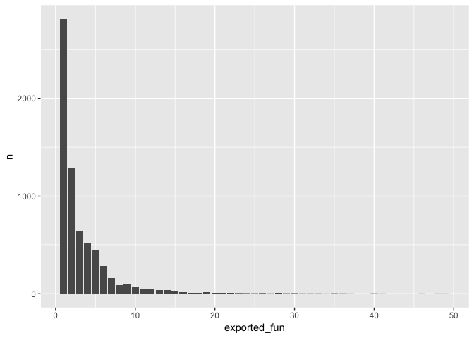

A little dive into CRAN package dependencies.

## What is a dependencies?

Roughly, a dependencie is a package needed by another package to work:
in other words, if someone has already coded a function that you need,
you can use it by listing another package as a dependency. But that also
implies that whenever someone install your package, the dependencies are
installed too.

## Where dependencies can be problematic

### Heavy dependencies

Some R packages are heavy, and can be complex to install on specific
machine. For example, `{readr}` does not install easily on small-RAM
ubuntu machine: [see this
issue](https://github.com/tidyverse/readr/issues/544)\] for more
information about that. That leads to not being able to install this
package, but also other packages dependending on `{readr}`: a behavior I
noticed lately with the `{rtweet}` package when I tried to install it on
a Digital Ocean small ubuntu droplet: [see this
issue](https://github.com/mkearney/rtweet/issues/246).

### The clipr effect

Whenever one of your dependencies is removed from the CRAN, your package
will be removed also. That happens to a series of package recently,
notably the `{reprex}` 📦, but that’s food for another blogpost [see this
issue](https://github.com/mdlincoln/clipr/issues/30) if you want to read
more in the meantime.

In a few words, just imagine that if A depends on B, B on C and C on D,
if ever the D package is removed from the CRAN, you’ll need to find a
solution to keep your package up to date.

## Dependencies when developping package

### How many dependencies?

It’s a tough question and everybody has its take on it. Mine is: try to
avoid them if:

  - The dependency has a lot of other dependencies / is heavy to install
  - You just need one easy to rewrite function from that package

To answer the first question, you can use :

``` r
library(miniCRAN)
pkgDep("attempt", suggests = FALSE)
```

    ## [1] "attempt" "rlang"

``` r
pkgDep("proustr", suggests = FALSE)
```

    ##  [1] "proustr"    "dplyr"      "magrittr"   "stringr"    "rlang"     
    ##  [6] "purrr"      "tidyr"      "tokenizers" "SnowballC"  "assertthat"
    ## [11] "bindrcpp"   "glue"       "pkgconfig"  "R6"         "Rcpp"      
    ## [16] "tibble"     "tidyselect" "BH"         "plogr"      "stringi"   
    ## [21] "bindr"      "cli"        "crayon"     "pillar"     "utf8"

Which means that at least all these packages will be installed whenever
I want to install one of these.

## Diving into the CRAN

Let’s answer the second question by having a look at how many package
from the CRAN have just one function imported from another package.

There would be several way to do that: but I chosed to parse the
NAMESPACE files, as it is the place where `Depends` and `Imports` are
listed with the same tag. Maybe not the most easy to deploy solution,
but I’ll be happy to hear about other solution\!

``` r
library(rvest)
library(purrr)
library(glue)

# Get the NAMESPACE file

extract_namespace <- function(package, exdir){
  cat(crayon::green(glue("Extracting {package} NAMESPACE to {exdir} at {Sys.time()}.")), sep = "\n")
  a <- read_html(glue("https://cran.r-project.org/web/packages/{package}/index.html")) %>%
    html_nodes("a") %>%
    html_attr("href") %>%
    keep(~ grepl("tar.gz", .x)) %>%
    gsub("\\.\\./\\.\\./\\.\\.", "https://cran.r-project.org", .)
  
  tmp <- tempfile(fileext = ".tar.gz")
  download.file(a, tmp)
  nspc <- grep("NAMESPACE", untar(tmp, list = TRUE), value = TRUE)
  untar(tmp, file = nspc, exdir = exdir)
  unlink(tmp)
}

# Parsing of the import fields
parse_import <- function(pkg, vec){
  cleaned <- gsub('\\(|,|\\)|"', " ", vec) 
  splitted_bis <- strsplit(cleaned, " ") %>% as_vector() %>% discard(~ nchar(.x) == 0)
  type <- splitted_bis[1]
  dep <- splitted_bis[2]
  fun <- splitted_bis[3:length(splitted_bis)]
  if ( grepl("From", cleaned) ) {
    data.frame(origin = pkg, 
               type = type, 
               dep = dep, 
               fun = fun, 
               stringsAsFactors = FALSE)
  } else {
    data.frame(origin = pkg,
               type = type, 
               dep = dep, 
               fun = NA, 
               stringsAsFactors = FALSE)
  }
}

# Parsing the full file
parse_namespace <- function(pkg, file){
  readLines(normalizePath(file)) %>%
    keep(~ grepl("import", .x)) %>%
    map2_df(pkg, ~ parse_import(.y, .x))
}

# Wrap all this into one
extract_pkg_and_df_namespace <- function(list, exdir = "nsp"){
  walk(list, extract_namespace, exdir = exdir)
  df <- data.frame(pkg = list.files(exdir), 
                   loc = list.files(exdir, recursive = TRUE, full.names = TRUE), 
                   stringsAsFactors = FALSE)
  map2_df(df$pkg, df$loc, parse_namespace)
}

# Get the package db
pkg_db <- tools::CRAN_package_db()

# FIRE 🛫 
res <- extract_pkg_and_df_namespace(pkg_db$Package)
```

So, don’t try this at home, but know it took around 4 hours for me to
retrieve all these data. \#\#\# Let’s explore

Here,
    we

``` r
library(tidyverse)
```

    ## ── Attaching packages ──────────────────────────────────────────────────────── tidyverse 1.2.1 ──

    ## ✔ ggplot2 2.2.1.9000     ✔ purrr   0.2.4     
    ## ✔ tibble  1.4.2          ✔ dplyr   0.7.5     
    ## ✔ tidyr   0.8.1          ✔ stringr 1.3.1     
    ## ✔ readr   1.1.1          ✔ forcats 0.3.0

    ## ── Conflicts ─────────────────────────────────────────────────────────── tidyverse_conflicts() ──
    ## ✖ dplyr::filter() masks stats::filter()
    ## ✖ dplyr::lag()    masks stats::lag()

``` r
fun_topo <- res %>%
  filter(type == "importFrom") %>%
  group_by(origin, dep) %>%
  summarise(exported_fun = n()) %>%
  ungroup()

fun_topo %>%
  arrange(desc(exported_fun))
```

    ## # A tibble: 6,759 x 3
    ##    origin           dep        exported_fun
    ##    <chr>            <chr>             <int>
    ##  1 aroma.affymetrix aroma.core          135
    ##  2 aroma.cn         aroma.core          116
    ##  3 aroma.core       R.filesets          106
    ##  4 bibliometrix     Matrix              105
    ##  5 DescTools        stats                94
    ##  6 aroma.affymetrix R.utils              90
    ##  7 aroma.core       R.utils              77
    ##  8 DiagrammeR       igraph               64
    ##  9 caret            stats                51
    ## 10 aroma.affymetrix R.filesets           50
    ## # ... with 6,749 more rows

``` r
fun_topo %>%
  filter(exported_fun >= 50) %>%
  arrange(desc(exported_fun)) 
```

    ## # A tibble: 11 x 3
    ##    origin           dep        exported_fun
    ##    <chr>            <chr>             <int>
    ##  1 aroma.affymetrix aroma.core          135
    ##  2 aroma.cn         aroma.core          116
    ##  3 aroma.core       R.filesets          106
    ##  4 bibliometrix     Matrix              105
    ##  5 DescTools        stats                94
    ##  6 aroma.affymetrix R.utils              90
    ##  7 aroma.core       R.utils              77
    ##  8 DiagrammeR       igraph               64
    ##  9 caret            stats                51
    ## 10 aroma.affymetrix R.filesets           50
    ## 11 circular         stats                50

``` r
fun_topo %>%
  filter(exported_fun < 50) %>%
  ungroup() %>%
  count(exported_fun) %>%
  ggplot() + 
  aes(exported_fun, n) + 
  geom_col()
```

<!-- -->

``` r
just_one <- fun_topo %>%
  filter(exported_fun == 1) %>%
  left_join(res)
```

    ## Joining, by = c("origin", "dep")

``` r
just_one %>% 
  count(dep, fun, sort = TRUE)
```

    ## # A tibble: 1,206 x 3
    ##    dep       fun           n
    ##    <chr>     <chr>     <int>
    ##  1 Rcpp      evalCpp     129
    ##  2 magrittr  %>%          75
    ##  3 methods   is           66
    ##  4 Rcpp      sourceCpp    54
    ##  5 graphics  plot         50
    ##  6 utils     combn        38
    ##  7 methods   new          34
    ##  8 utils     tail         30
    ##  9 MASS      mvrnorm      29
    ## 10 grDevices rgb          28
    ## # ... with 1,196 more rows
