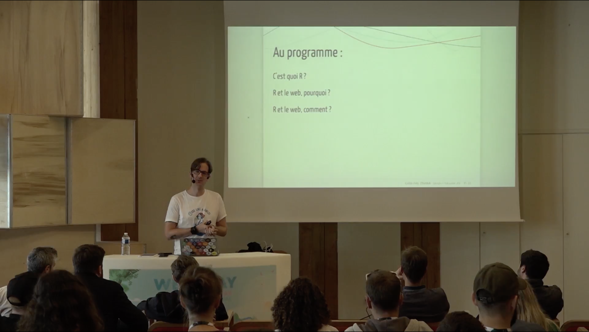
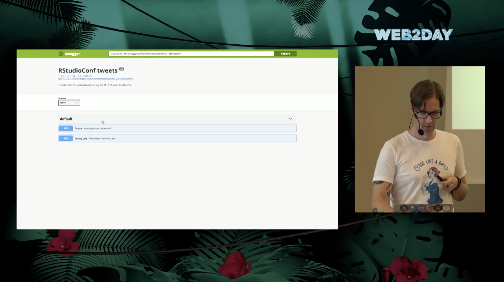
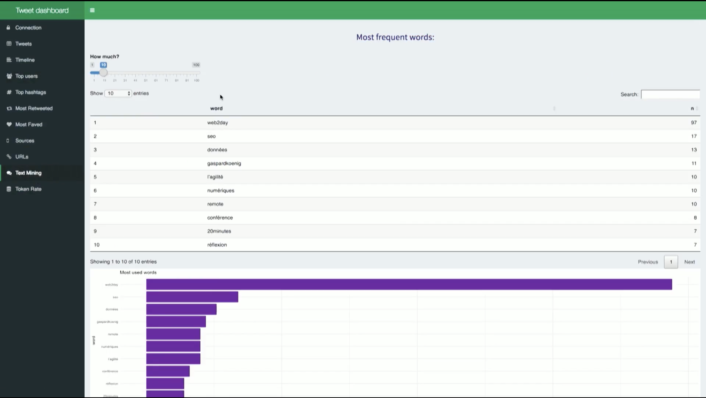

Earlier this week, my talk at the [Web2Day](https://web2day.co/)
conference was put online. Here is an english summary for those who
don’t understand french :)

> Disclaimer: this talk has been given during a conference about web
> technologies. In other word,in front of a crowd that has never /
> hardly heard about R before. If you’re already familiar with R,
> Rmarkdown, Shiny and {plumber}, you won’t find anything groundbreaking
> here.

## The video

If ever you understand french, here is the
video:

<div data-align="center">

<iframe width="560" height="315" src="https://www.youtube.com/embed/8aRmY3A6raU?rel=0" frameborder="0" allow="autoplay; encrypted-media" allowfullscreen>

</iframe>

</div>

> Note: the title of the conference can be translated “When a data
> science language produces web content.”

## Doing web content with R



### What is R?

The introduction of the talk is about “what is R?”. I won’t redo this
introduction here, as **there are a lot of resources available online to
discover R** (and I’m pretty sure that if you’re here, you already know
R ;) ):

  - [Official ‘What is R’ from the r-project
    website](https://www.r-project.org/about.html)

  - [Beginner’s guide to R:
    Introduction](https://www.computerworld.com/article/2497143/business-intelligence/business-intelligence-beginner-s-guide-to-r-introduction.html)

  - [What is R?](https://www.quora.com/What-is-R-programming-language)

### Why doing web content with R?

There are many reasons why you would want to produce web content with R:

  - You need to communicate your results

  - You need to visualise your results dynamically

  - You need to share R content with others other the internet

  - You want to make R available through a user interface, so that
    people can get the full potential of R without writing any line of
    code

### Why doing R with a web technology?

  - Use R computation performances

  - Call / use the latest datascience methods from a webpage

## How?

### Easy to produce webpages with markdown

With Rmarkdown, you can produce a web page that contains the results of
your experiment / research / data collection / visualisation, done in R.

**Markdown is an easy to use, simplified version of html which can be
compiled as html**. Meaning that you can use any html, css or JavaScript
content. For example, a table can be converted as a JS datatable, which
is dynamic.

Here is an example of a webpage created with
    R:

  - <http://random.colinfay.me/markdown.html>
  - <https://github.com/ColinFay/conf/blob/master/2018-06-Web2Day-Nantes/markdown.Rmd>
    (the code that produces this page)

Nothing fancy here, but you got the idea.

> Read more about Rmarkdown at <https://rmarkdown.rstudio.com/>

### An API with {plumber}

{plumber} is **an R package that can creates API, that is to say a
web-service that runs R**, and that you can access through an URL. This
URL has endpoints, and when you send information to these endpoints, an
R function is executed, with the params given to the API.



One you’ve got this url, it can be integrated simply to any webpage. For
example, if my API, at <http://127.0.0.1:3953>, produces a plot, I can
do :

    <!DOCTYPE html>
    <html>
    <body>
    
    <h1>Yihaaa </h1>
    
    <h2>Ce graphe est généré par R et c'est de la balle.</h2>
    
    
    
    
    </body>
    </html>

**As {plumber}, by default, produces JSON content (but you can pass a
lot of other types of content), if can be easily integrated into any web
page**. That means you can make R do all the heavy computation, and just
get the result as a JSON to be integrated on your webpage.

  - The API definition :
    <https://github.com/ColinFay/conf/blob/master/2018-06-Web2Day-Nantes/api.R>
  - Launching the API :
    <https://github.com/ColinFay/conf/blob/master/2018-06-Web2Day-Nantes/api.Rmd>

## About Shiny

### Using Shiny to produce web app

Shiny is an amazing framework from RStudio, used to **produce web app
that can run R**, written with R code: meaning that it can run any R
model, use any R dataviz library, take advantage of R file importing
packages, etc etc.

Creating Shiny apps has been one of our main area of work at
[ThinkR](https://rtask.thinkr.fr/design-and-deployment-of-shiny-applications/)
lately, and **we’ve build quite large applications that run complex
model, which are then visualised in the same app**. What’s the point of
this app? To give access to these models to people who don’t know how to
code (and don’t want to).

### Basic Shiny Designs

When designing a Shiny app, you can use a lot of already implemented
design libraries and templates. **These produce nice results, and
everything can be written in R, which makes it easy to use for R
developers who don’t know html, css and JS** (even if we can definitely
say that when it comes to building large applications, you should at
some point learn at least html and css).

These basics packages produce contents like the one I’m showing in the
talk:



Here, I’m **creating a little dashboard that connects to Twitter, and
does simple dataviz, counting, and text-mining**. Everything, here, done
in R.

> Note: this app will be made open-source one day, when I’ll have found
> some times to finish it :)

### Advanced Shiny design

Or, what I call: Webdev + R = ❤️

When **doing more advanced Shiny designs**, we can use htmlTemplates (a
feature which is not known enough). This functionnality allows you to
create html and css templates as any web developer would do. And of
course, with JS in it if you want to.

Once you’ve got this template, you can use it straight in Shiny.

For example:

    # styles.css
    body {
     font-family: 'Source Sans
    Pro', Helvetica, sans-serif;
     background: #121212;
     color: #999;
     padding: 20px;
    }
    tr {
     vertical-align: top;
    }
    ...

<script src="https://gist.github.com/ColinFay/5e4973c6c691508daa5611f4fd9e9707.js"></script>

These html and css templates are “easy” (well, relatively easy) to
implement if you’re a web designer. But, let’s be honnest, they are
really hard to code if you’re a data scientist.

From the R point of view, this is as simple as creating a function that
does:

``` r
horizontalBox <- function(title, content){
  htmlTemplate("box.html", title = title, content = content)
}
```

You can recognize here that I am calling the box.html template, with the
arguments of the function being the elements between {.


## Might we work together?

**I am not a web designer, and web designers are not data scientists, so
neither of us can pretend to do a better job than the other. But the
good news is that everything is there for us to work together.**

So, if ever some web designer is interested to work with me on a Shiny
app (everything open source of course), I’ll be glad to do so, as I’m
sure we have a lot to learn from each other.

Feel free to out to me throught mail or on
[twitter](https://twitter.com/_ColinFay)\!

## Slides

The slides from the talk are available
here:

<https://github.com/ColinFay/conf/blob/master/2018-06-Web2Day-Nantes/web2day.pdf>

The content of the .R, Rmd, etc, are here:

<https://github.com/ColinFay/conf/tree/master/2018-06-Web2Day-Nantes>
