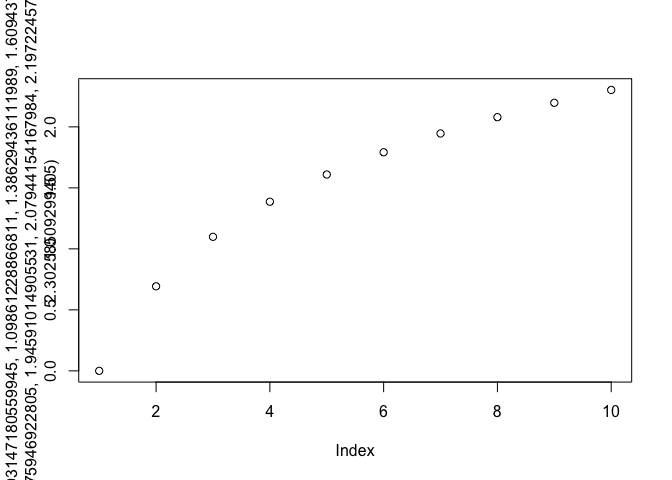

A follow-up on Thomas Lumley [follow-up
post](http://notstatschat.rbind.io/2018/07/30/quoting-and-macros-in-r/)
on Miles McBain [post about
quotation](https://milesmcbain.xyz/the-roots-of-quotation/).

In this post, Thomas is continuing Miles exploration of the concept of
quoting and evaluation in R. Thomas speaks a little bit about lazy
evaluation, and I decided to continue to explore this concept. Notably I
wish to start over from on this quote from the blogpost:

> “In reality, to allow for lazy evaluation, R has a special data
> structure called a promise, which stores the expression until you look
> at it then evaluates it. R also has substitute() to get the expression
> out of the promise.”

## Lazy Eval: a starting point

[I’ve already written about](https://colinfay.me/tidyeval-1/) lazy
evaluation, but here is more about that concept.

### A quick definition

Lazy evaluation is a programming strategy that allows a **symbol to be
evaluated only when needed**. In other words, a symbol can be defined
(e.g in a function), and it will only be evaluated when it is needed
(and that moment can be never). This is why you can do:

``` r
plop <- function(a, b){
  a * 10
}
plop(4)
```

    ## [1] 40

Here, `b` is defined as a function argument, but never evaluated. So no
error here. This strategy is called “lazy” as it do “the strict minimum”
of evaluation (remember that evaluating is looking for the value of a
symbol).

Lazy evaluation means you can also do:

``` r
plop(a = 4, b = non_existing_variable)
```

    ## [1] 40

As `b` is never evaluated, we don’t have any problem.

We can also find it in control structure:

``` r
if (TRUE){
  12
} else {
  no_variable
}
```

    ## [1] 12

And of course this works on the other side:

``` r
if (FALSE){
  no_variable
} else {
  12
}
```

    ## [1] 12

### Why lazy eval

Lazy evaluation is implemented in R as it allows a program to be more
efficient: when you run a series of calls, only the necessary symbols
are evaluated, that is to say that only the needed objects will be
loaded in memory. The downside being that it can make a program less
predictable, as you are never 100% sure a symbol will be evaluated.

Its opposite is strict/eager evaluation, which is the default in most
programming languages.

### LazyData, and promises

If specified in the DESCRIPTION, datasets from packages are lazily
loaded. It means two things :

  - When `library(pkg)`, the datasets are not loaded in the environment
  - That you can “preload” them with `data("dataset")`, and get a
    promise back

If you run this in a fresh R session:

``` r
library(ggplot2)
data("diamonds")
```

This is what you’re going to get:


A `<Promise>`.

At this point, as I still don’t have called for the dataset, the symbols
(`diamonds`) holds a promise to this dataset, which is sill not in
memory:

``` r
library(pryr)
mem_used()
```

    ## 44.2 MB

``` r
#Now I need starwars
nrow(diamonds)
```

    ## [1] 53940

``` r
mem_used()
```

    ## 47.7 MB

As you can see, the memory used by my R session has changed when I
actually needed `diamonds`. This latter is no longer a promise, but a
loaded dataset in my environment.

But `substitute` doesn’t “break the promise”:

``` r
data("txhousing")
mem_used()
```

    ## 47.7 MB

``` r
substitute(txhousing)
```

    ## txhousing

``` r
mem_used()
```

    ## 47.7 MB

``` r
nrow(txhousing)
```

    ## [1] 8602

``` r
mem_used()
```

    ## 48.3 MB

Here is an example of Non-standard evaluation with `substitute`: even if
I’m passing `txhousing` as a symbol, `substitute(txhousing)` does not
behave as `nrow(txhousing)`. The symbol is not evaluated in the standard
way, the promises is still a promises, and the symbol `txhousing` does
not bring the object in the environment.

Let’s just put it into a function:

``` r
substiplop <- function(dataset){
  # deparse turns a symbol into a character
  name <- deparse(substitute(dataset))
  paste("You called", name)
}

library(ggplot2)
mem_used()
```

    ## 48.3 MB

``` r
a <- substiplop(dataset = economics_long)
a
```

    ## [1] "You called economics_long"

``` r
mem_used()
```

    ## 48.3 MB

As you can see, no `economics_long` has been evaluated. Now compare:

``` r
nrowplop <- function(dataset){
  paste("You called a dataset with", nrow(dataset))
}

mem_used()
```

    ## 48.3 MB

``` r
b <- nrowplop(dataset = economics_long)
b
```

    ## [1] "You called a dataset with 2870"

``` r
mem_used()
```

    ## 48.4 MB

Keep all this in mind, we’ll be back to it in a few.

## Learning more about lazy evaluation

Ok, now, now let’s dig deeper into lazy evaluation.

### RTFM

Let’s start with the beginning: the R-Manuals. `promises` and `lazy
evaluation` are refered to several times in the [R Language
Definition](http://colinfay.me/r-language-definition/).

If we go to [Promise
objects](http://colinfay.me/r-language-definition/objects.html#promise-objects),
we learn that :

> Promise objects are part of R’s **lazy evaluation** mechanism. They
> contain three slots: a **value**, an **expression**, and an
> **environment**. When a function is called the arguments are matched
> and then each of the formal arguments is bound to a promise. The
> expression that was given for that formal argument and a pointer to
> the environment the function was called from are stored in the
> promise.

What that means is that: when calling a function, arguments are turned
into `promises`. These `promises` contains: an expression, and an
environment (no value at first). In a sense, what this object holds is
not a value, but **a recipe for a value**, saying “evaluate this
expression in this environment”, and this recipe is called only when we
need it.

> Until that argument is accessed there is **no value associated with
> the promise**. When the argument is accessed, the stored expression is
> evaluated in the stored environment, and the result is returned. The
> result is also saved by the promise. **The substitute function will
> extract the content of the expression slot. This allows the programmer
> to access either the value or the expression associated with the
> promise**.

So, here’s a clear definition for the `substitute` function: an
“expression slot content extractor” :) In other words, when passing
arguments to a function, they are immediatly turned into a promise, a
data structure with an expression, and a recipe for a value. But here’s
the catch: thanks to lazy evaluation, **you can access this expression
without having to actually give an argument a value**.

Remember our fonction `plop`, and :

``` r
plop(a = 4, b = non_existing_variable)
```

    ## [1] 40

With our newly acquired knowledge, we can tell what’s happening here: b
is created as a promised, containing the expression
`non_existing_variable`. It contains no value, but as we never try to
actually evaluate (i.e. try to acess its value), there is no error.

Let’s continue on that note: `b` is created as a promise, and
`substitute` allows to get the expression out of a promises. So we could
modify our function to play with the expression contained in `b`:

``` r
plop <- function(a, b) {
  cat("You entered", deparse(substitute(b)), "as `b` \n")
  a * 10
}
plop(a = 4, b = non_existing_variable)
```

    ## You entered non_existing_variable as `b`

    ## [1] 40

But that also means we can evaluate `b` the way we want (for example to
create a `dplyr::pull`-like function)

``` r
plop <- function(a, b) {
  eval(substitute(b), envir = a)
}
plop(iris, Species)[1:10]
```

    ##  [1] setosa setosa setosa setosa setosa setosa setosa setosa setosa setosa
    ## Levels: setosa versicolor virginica

``` r
plop(iris, Sepal.Length)[1:10]
```

    ##  [1] 5.1 4.9 4.7 4.6 5.0 5.4 4.6 5.0 4.4 4.9

(More about environment evaluation
[here](https://colinfay.me/explain-environments-eli5/))

Or, even, that we could write a `dplyr::mutate`-like function:

``` r
mutator <- function(a, col_name_computation){
  # In three steps here to detail the process, could be one line of code
  col_name_computation_sub <- substitute(col_name_computation)
  res <- eval(col_name_computation_sub, envir = a)
  a$new_col <- res
  a
}
mutator(head(iris), Sepal.Length * 10)
```

    ##   Sepal.Length Sepal.Width Petal.Length Petal.Width Species new_col
    ## 1          5.1         3.5          1.4         0.2  setosa      51
    ## 2          4.9         3.0          1.4         0.2  setosa      49
    ## 3          4.7         3.2          1.3         0.2  setosa      47
    ## 4          4.6         3.1          1.5         0.2  setosa      46
    ## 5          5.0         3.6          1.4         0.2  setosa      50
    ## 6          5.4         3.9          1.7         0.4  setosa      54

(Of course, the real `dplyr::mutate` does A LOT more, it’s juste for the
example)

Let’s sum up what is happening here :

  - I give `a` and `new_col` a expressions as inputs
  - Both `a` and `new_col` become promises, linked to the expressions
    given as inputs. None are evaluated at this point, thanks to lazy
    evaluation
  - The function extract the expression contained in
    `col_name_computation`, puts it in `col_name_computation_sub`, which
    is at that stage a `call`.
  - The function changes the rules of evaluation, and this `call` is
    evaluated in the context of the dataframe given (remember that
    dataframes are lists, and you can `eval` a symbol inside a list).
  - This newly created vector is put inside the dataframe
  - The modified data.frame is returned.

To dissect a little bit what is happening:

``` r
mutator <- function(a, col_name_computation){
  col_name_computation_sub <- substitute(col_name_computation)
  cat("`col_name_computation_sub` is: ")
  print(col_name_computation_sub)
  cat("its class is: ")
  print(class(col_name_computation_sub))
  cat("it is evaluated in: ")
  print(substitute(a))
  
  res <- eval(col_name_computation_sub, envir = a)
  cat("`res` is: ")
  print(res)
  
  a$new_col <- res
  invisible(a)
}
mutator(head(iris), Sepal.Length * 10)
```

    ## `col_name_computation_sub` is: Sepal.Length * 10
    ## its class is: [1] "call"
    ## it is evaluated in: head(iris)
    ## `res` is: [1] 51 49 47 46 50 54

``` r
mutator(head(mtcars), mpg * disp)
```

    ## `col_name_computation_sub` is: mpg * disp
    ## its class is: [1] "call"
    ## it is evaluated in: head(mtcars)
    ## `res` is: [1] 3360.0 3360.0 2462.4 5521.2 6732.0 4072.5

### Detecting `promises`

In case you were wondering how to check if something is a promise… let’s
continue from the manual:

> Within the R language, promise objects are almost only seen
> implicitly: actual function arguments are of this type. There is also
> a delayedAssign function that will make a promise out of an
> expression. There is generally **no way in R code to check whether an
> object is a promise or not**, **nor is there a way to use R code to
> determine the environment of a promise**.

Well, in a sense there is a way to create a `promise`, through the
`delayedAssign` function. Still not sure of a use case, but…

``` r
delayedAssign("a", this_var)
a
```

    ## Error in eval(expr, envir, enclos): object 'this_var' not found

``` r
this_var <- 12
a
```

    ## Warning: restarting interrupted promise evaluation

    ## [1] 12

### Evaluation, and `force()`ing evaluation

From [Argument
evaluation](http://colinfay.me/r-language-definition/functions.html#argument-evaluation):

> The process of filling the value slot of a promise by evaluating the
> contents of the expression slot in the promise’s environment is called
> **forcing the promise**. A promise will only be forced once, the value
> slot content being used directly later on. A promise is forced when
> its value is needed.

Forcing is “filling” the value slot of a promise. This can be done by
simply calling the object, or by using the `force` function (note that
`force` is just semantic sugar). Let’s see how this can be usefull with
a plot (from
[Substitutions](http://colinfay.me/r-language-definition/computing-on-the-language.html#substitutions))

``` r
logplot <- function(y, ylab = deparse(substitute(y))) {
    y <- log(y)
    plot(y, ylab = ylab)
}
logplot(1:10)
```

<!-- -->

Here, as `ylab` is forced after `y` has changed, the labels is the one
from the modified `y`. Which can be changed if we force the ylab before:

``` r
logplot <- function(y, ylab = deparse(substitute(y))) {
    force(ylab)
    y <- log(y)
    plot(y, ylab = ylab)
}
logplot(1:10)
```

<!-- -->

As said before: the promise is only forced once, so `ylab` finds its
value in the first line of code.

## More about lazy evaluation

Here are some random quotes and elements found on the internet:

  - Lazy Evaluation at the [Portland Pattern
    Repository](http://wiki.c2.com/?LazyEvaluation)

> Lazy evaluation : Waiting until the last possible moment to evaluate
> an expression, especially for the purpose of optimizing an algorithm
> that may not use the value of the expression.

  - Advanced R on [Function
    arguments](http://adv-r.had.co.nz/Functions.html#function-arguments)

  - [Why Functional Programming
    Matters](https://www.cs.kent.ac.uk/people/staff/dat/miranda/whyfp90.pdf)

> Since this method of evaluation runs f as little as possible, it is
> called “lazy evaluation”. It makes it practical to modularize a
> program as a generator that constructs a large number of possible
> answers, and a selector that chooses the appropriate one. While some
> other systems allow programs to be run together in this manner, only
> functional languages (and not even all of them) use lazy evaluation
> uniformly for every function call, allowing any part of a program to
> be modularized in this way. Lazy evaluation is perhaps the most
> powerful tool for modularization in the functional programmer’s
> repertoire.
