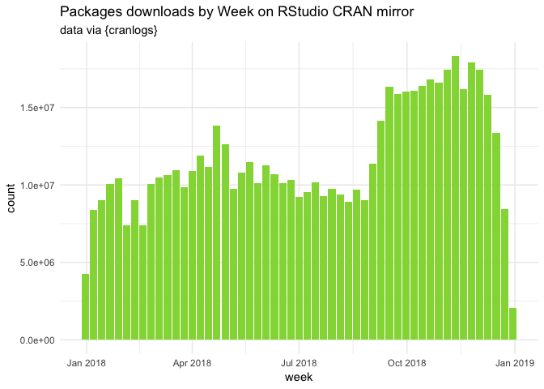
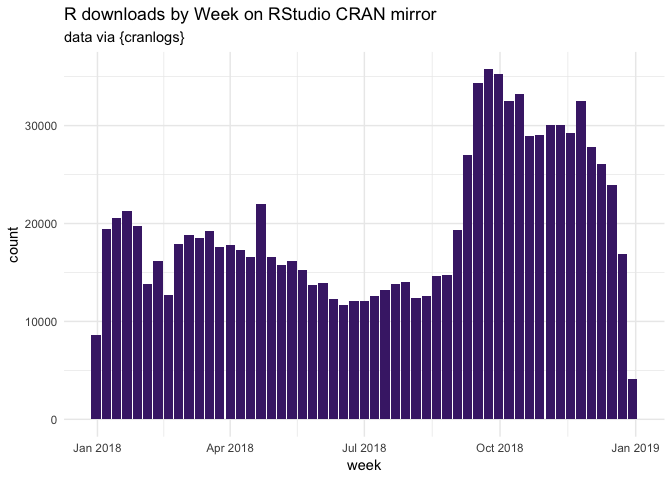
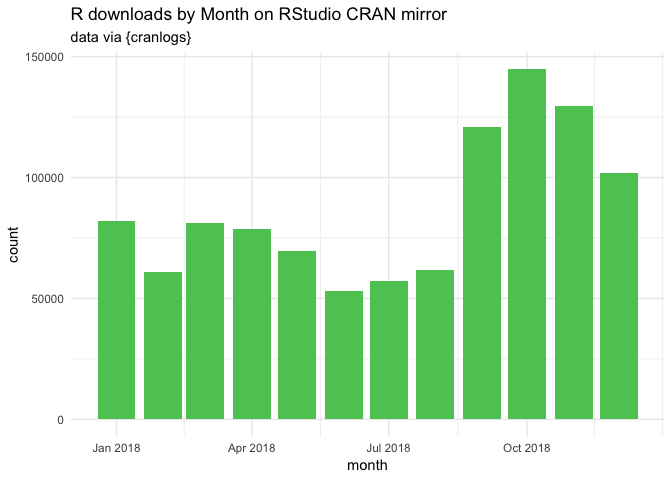

2018 at glance with `{cranlogs}`.

<!--more-->

Let’s load the necessary packages.

``` r
library(cranlogs)
library(data.table)
library(lubridate)
```

    ## 
    ## Attaching package: 'lubridate'

    ## The following objects are masked from 'package:data.table':
    ## 
    ##     hour, isoweek, mday, minute, month, quarter, second, wday,
    ##     week, yday, year

    ## The following object is masked from 'package:base':
    ## 
    ##     date

``` r
library(ggplot2)
library(magrittr)
```

## All downloads

We’ll use `{cranlogs}` to retrieve the data from the RStudio CRAN
mirror.

First, the number of package downloads by day in 2018.

``` r
total_dl <- cran_downloads(from = "2018-01-01", to = "2018-12-31")

# Turn to a data.table
setDT(total_dl)

# Round the date to month and week
total_dl[, `:=`(
  round_week = floor_date(date, "week" ),
  round_month = floor_date(date, "month" )
  ) ]
```

How many download in total?

``` r
total_dl[, .(total = sum(count))]
```

    ##        total
    ## 1: 614548197

Let’s plot this:

``` r
random_viridis <- function(n){
  sample(viridis::viridis(100), n)
}
total_dl[, .(count = sum(count)), round_week] %>%
  ggplot(aes(round_week, count)) + 
  geom_col(fill = random_viridis(1)) + 
  labs(
    title = "Packages downloads by Week on RStudio CRAN mirror", 
    subtitle = "data via {cranlogs}", 
    x = "week"
  ) + 
  theme_minimal()
```

<!-- -->

``` r
total_dl[, .(count = sum(count)), round_month] %>%
  ggplot(aes(round_month, count)) + 
  geom_col(fill = random_viridis(1)) + 
  labs(
    title = "Packages downloads by Month on RStudio CRAN mirror", 
    subtitle = "data via {cranlogs}", 
    x = "month"
  ) + 
  theme_minimal()
```

<!-- -->

## R download

Let’s now have a look at the number of downloads for R itself:

``` r
total_r <- cran_downloads("R", from = "2018-01-01", to = "2018-12-31")

setDT(total_r)

total_r[, `:=`(
  round_week = floor_date(date, "week" ),
  round_month = floor_date(date, "month" )
) ]
```

How many download in total?

``` r
total_r[, .(total = sum(count))]
```

    ##      total
    ## 1: 1041727

Plotting this:

``` r
total_r[, .(count = sum(count)), round_week] %>%
  ggplot(aes(round_week, count)) + 
  geom_col(fill = random_viridis(1)) + 
  labs(
    title = "R downloads by Week on RStudio CRAN mirror", 
    subtitle = "data via {cranlogs}", 
    x = "week"
  ) + 
  theme_minimal()
```

<!-- -->

``` r
total_r[, .(count = sum(count)), round_month] %>%
  ggplot(aes(round_month, count)) + 
  geom_col(fill = random_viridis(1)) + 
  labs(
    title = "R downloads by Month on RStudio CRAN mirror", 
    subtitle = "data via {cranlogs}", 
    x = "month"
  ) + 
  theme_minimal()
```

<!-- -->

Let’s have a look to the number of download by R
version:

``` r
total_r[, .(count = sum(count)), version][order(count, decreasing = TRUE)] %>%
  head(10)
```

    ##          version  count
    ##  1:        3.5.1 464837
    ##  2:        3.4.3 174665
    ##  3:        3.5.0 137886
    ##  4:        3.4.4 107124
    ##  5:       latest  32642
    ##  6: 3.5.1patched  32119
    ##  7:        3.3.3  27992
    ##  8:        3.5.2  21645
    ##  9:        devel   8543
    ## 10:        3.2.4   4814

``` r
total_r[, .(count = sum(count)), version][order(count)] %>%
  head(10)
```

    ##        version count
    ##  1:    3.5.1rc     2
    ##  2:  3.5.2beta     2
    ##  3:    3.5.2rc     6
    ##  4:  3.5.0beta     8
    ##  5:    3.4.4rc    11
    ##  6: 3.5.0alpha    11
    ##  7:    3.5.0rc    12
    ##  8:      2.6.1    13
    ##  9:      2.8.0    16
    ## 10:      2.2.1    17

``` r
total_r[, .(count = sum(count)), version][order(count, decreasing = TRUE)] %>%
  head(10) %>% 
  ggplot(aes(reorder(version, count), count)) +
  coord_flip() +
  geom_col(fill = random_viridis(1)) + 
  labs(
    title = "10 most downloaded R versions in 2018 on RStudio CRAN mirror", 
    subtitle = "data via {cranlogs}", 
    x = "version"
  ) + 
  theme_minimal()
```

<!-- -->

And by os:

``` r
total_r[, .(total = sum(count)), os]
```

    ##     os  total
    ## 1: osx 228573
    ## 2: win 767319
    ## 3: src  42725
    ## 4:  NA   3110

And a happy new year 🎉🎉
