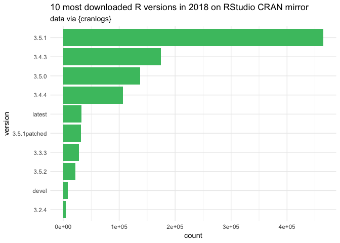

Some days ago I read an article on [dev.to](https://dev.to/), entitled
something like “One week as a Software developer - what did I search?”
(I can’t find back the link :( ). And then, I thought… hey, I should do
that too\!

## Getting the data

You can download your browser data at
[takeout.google.com/](https://takeout.google.com/). In a matter of
minutes, I had a beautiful JSON which I could bring back in
R.

``` r
res <- jsonlite::read_json("~/Downloads/Takeout/Chrome/BrowserHistory.json")
library(data.table)
library(magrittr)
df <- rbindlist(res[[1]], fill = TRUE)  
setDT(df)
str(df)
```

    ## Classes 'data.table' and 'data.frame':   175321 obs. of  6 variables:
    ##  $ favicon_url    : chr  "https://www.google.com/favicon.ico" "https://www.google.com/favicon.ico" "https://www.google.com/favicon.ico" "https://www.google.com/favicon.ico" ...
    ##  $ page_transition: chr  "LINK" "LINK" "LINK" "LINK" ...
    ##  $ title          : chr  "Télécharger vos données" "Gérer les archives" "Télécharger vos données" "Télécharger vos données" ...
    ##  $ url            : chr  "https://takeout.google.com/settings/takeout" "https://takeout.google.com/settings/takeout/downloads" "https://takeout.google.com/settings/takeout" "https://takeout.google.com/?pli=1" ...
    ##  $ client_id      : chr  "slOska0n/CmNUGlceIGQVQ==" "slOska0n/CmNUGlceIGQVQ==" "slOska0n/CmNUGlceIGQVQ==" "slOska0n/CmNUGlceIGQVQ==" ...
    ##  $ time_usec      : num  1.57e+15 1.57e+15 1.57e+15 1.57e+15 1.57e+15 ...
    ##  - attr(*, ".internal.selfref")=<externalptr>

First thing first, get the data from last week.

What about this weird time column?

``` r
df[, .(time_usec = as.character(time_usec))] %>% head()
```

    ##           time_usec
    ## 1: 1567623891808102
    ## 2: 1567623890295210
    ## 3: 1567623886825938
    ## 4: 1567623866374017
    ## 5: 1567623864604245
    ## 6: 1567623851481596

When seeing these numbers, one thinks of [Unix
timestamp](https://en.wikipedia.org/wiki/Unix_time), which is *“the
number of seconds that have elapsed since 00:00:00 Thursday, 1 January
1970”*.
So…

``` r
df[, .(time_usec = as.POSIXct(time_usec, origin="1970-01-01"))] %>% head()
```

    ##                  time_usec
    ## 1: 49677993-08-02 03:48:22
    ## 2: 49677993-07-15 15:33:30
    ## 3: 49677993-06-05 11:52:18
    ## 4: 49677992-10-11 18:46:57
    ## 5: 49677992-09-21 07:10:45
    ## 6: 49677992-04-22 09:59:56

Well, unless I’ve been trapped in a weird time machine or that episode
of Game of Thrones was very, very long, I don’t remember being in year
`49677993` :)

I have no idea why this number are that long: if we look at today’s
date, we’ve got a UNIX time stamp of

``` r
as.numeric(Sys.time())
```

    ## [1] 1567969463

``` r
# versus
df[, as.character(time_usec)] %>% head(1)
```

    ## [1] "1567623891808102"

Today’s UNIX date, which has a step of one second, is a 10 digits long
number. The time stamp in this dataset are 16 digits longs. But we can
also notice that the 10 first digits of both are relatively close:
`156780` and `156762`.

My guess so far is that the data are in microseconds, as one microsecond
is `1e-6` second. Let’s give this a
shot:

``` r
df[, time_usec := as.POSIXct(time_usec / 1e6, origin="1970-01-01")][, time_usec] %>% head()
```

    ## [1] "2019-09-04 21:04:51 CEST" "2019-09-04 21:04:50 CEST"
    ## [3] "2019-09-04 21:04:46 CEST" "2019-09-04 21:04:26 CEST"
    ## [5] "2019-09-04 21:04:24 CEST" "2019-09-04 21:04:11 CEST"

AH\! That looks better\! Let’s filter and turn the title to lowercase.

``` r
library(anytime)
week <- df[
  time_usec > anytime("2019-08-25") &
    time_usec < anytime("2019-09-02") 
  ][,
    tite := tolower(title)
    ]
```

Let’s now filter only the Google search:

``` r
search <- week[
  grep("www.google.com/search", url), 
  ]
```

And count the number of search by day:

``` r
library(ggplot2)
ggplot(search, aes(as.Date(time_usec))) + 
  geom_bar() + 
  labs(
    title = "Search by day of the week (Monday to Sunday)", 
    x = "Day of the week"
  )
```

<!-- -->

## Some extracts

Let’s now have a look at some of the search terms:

### Shiny

``` r
search[
    grep("shiny", title), gsub(" - Recherche Google", "", title)
    ] %>% unique()
```

    ##  [1] "suspend an observe event in shiny"         
    ##  [2] "create a new shiny app from command line"  
    ##  [3] "shiny flush react"                         
    ##  [4] "shiny delete input binding"                
    ##  [5] "shiny delete an input binding from ui side"
    ##  [6] "shiny dashboard link to a specific tab"    
    ##  [7] "remove input value shiny r"                
    ##  [8] "remove input value shiny"                  
    ##  [9] "log everything shiny does"                 
    ## [10] "shiny .graphDependsOnId"                   
    ## [11] "date picker widget shiny"                  
    ## [12] "jquery datepicker shiny"                   
    ## [13] "shiny daterangeinput end before finish"    
    ## [14] "shiny date range input"                    
    ## [15] "shinyapps io"                              
    ## [16] "dreal shiny apps"                          
    ## [17] "shinyexample"                              
    ## [18] "daterangeinput shiny end superior to start"
    ## [19] "shiny date range"                          
    ## [20] "shiny date picker"                         
    ## [21] "shiny DT disablee row name"                
    ## [22] "shiny jqui"                                
    ## [23] "shiny jsqui"                               
    ## [24] "option shiny browser viwer"

You can note that:

  - I can never remember how to set which Viewer Shiny uses
  - I had trouble with Shiny dateRangeInput being able to [end before
    start](https://github.com/rstudio/shiny/issues/2043) and tried to
    see for other alternative.
  - Also, this weird one, where I saved some reactiveValue to a MongoDB
    storage, and when I tried to reuse them, I had an error about the
    `.graphDependsOnId` function not found. Turns out it’s an [old Shiny
    function](https://rdrr.io/github/ymd526442121/Rproject_shiny/src/R/graph.R),
    which might have been saved in the RDS saved in the mongo DB (well,
    that’s my guess). My solution was to take this piece of code from
    the source and put it back in my app.
  - I had some trouble with the behavior of a restarting app and the
    `removeUI` function, which in fact does not [remove the input
    value](https://github.com/rstudio/shiny/issues/2374). Also, it’s
    interesting to note that some input are not fully restored when
    restarting the app with Firefox, so I wanted to look for a way to
    (really) delete input from the JS side (unsuccessfully so far).
  - I also wondered if there was a kind of `shiny::createApp()`, which
    creates a file with the app skeleton in it. When you use the RStudio
    interface for creating app, you’ve got an app skeleton. That must be
    somewhere.

### R

``` r
search[
    grep(" r ", title), gsub(" - Recherche Google", "", title)
    ] %>% unique()
```

    ## [1] "remove input value shiny r"             
    ## [2] "whereami r package"                     
    ## [3] "wherami r package"                      
    ## [4] "fs r package"                           
    ## [5] "docopt r"                               
    ## [6] "insert page break in pagedown r pacakge"
    ## [7] "new page in pagedown r pacakge"

Nop, still can’t remember how to insert a page break in `{pagedown}`.

Also, still can’t write “package” correctly.

### JavaScript

Yes, being a Shiny developer means you do a significant amount of
JavaScript / jQuery.

``` r
search[
    grep("javascript|jquery", title), gsub(" - Recherche Google", "", title)
    ] %>% unique()
```

    ##  [1] "change variable evaluation environment in javascript"
    ##  [2] "environment in javascript"                           
    ##  [3] "comafy javascript"                                   
    ##  [4] "jquery parent"                                       
    ##  [5] "find element with data attribute jquery"             
    ##  [6] "javascript function"                                 
    ##  [7] "confirmation pop up in javascript"                   
    ##  [8] "function in javascript"                              
    ##  [9] "javascript void"                                     
    ## [10] "non standard evaluation in javascript"               
    ## [11] "list all variables javascript"                       
    ## [12] "javascript reload page and launch a function"        
    ## [13] "javascript fin anywhere in object"                   
    ## [14] "get class of javascript object"                      
    ## [15] "get class of element jquery"                         
    ## [16] "add onclick event jquery"                            
    ## [17] "jquery datepicker shiny"                             
    ## [18] "jquery launch function on div change"                
    ## [19] "jquery extract id of all children"                   
    ## [20] "javascript for loop"                                 
    ## [21] "jquery drag and drop"                                
    ## [22] "reorder list javascript"

Let’s admit that:

  - I can never remember the correct syntax for for loops in JavaScript.
    Like, ever. I always try `for (var i, i < x.length, i++)`. That’s
    `;`, Colin, maybe writing it there will make me remember :)  
  - The “find anywhere in object” and JavaScript launch and reload were
    still linked to my refresh input in Shiny issue.
  - And apparently it’s more complicated than I had expected to play
    with symbols and environment in JavaScript
