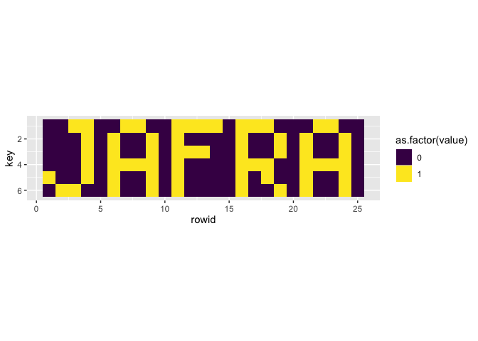

Solving Advent of Code 2019-08 with R and JavaScript.

\[Disclaimer\] Obviously, this post contains a big spoiler about Advent
of Code, as it gives solutions for solving day 8.

## About the JavaScript code

The JavaScript code has been written in the same RMarkdown as the R
code. It runs thanks to the `{bubble}` package:
<https://github.com/ColinFay/bubble>

## Instructions

Find the instructions at: <https://adventofcode.com/2019/day/8>

## R solution

### Part one

``` r
library(magrittr)
library(purrr)

ipt <- read.delim("input8.txt", header = FALSE, colClasses = "character")$V1
ipt <- strsplit(ipt, "")[[1]] %>% as.numeric()

layers_size <- 6 * 25
l <- list()

for (i in 1: (length(ipt)/layers_size)){
  l[[i]] <- ipt[1:150]
  ipt <- ipt[151:length(ipt)]
}

mn <- l %>%
  lapply(table) %>%
  map_dbl("0") %>%
  which.min()

l[[mn]] %>%
  table()
```

    ## .
    ##   0   1   2
    ##   7  14 129

``` r
14 * 129
```

    ## [1] 1806

### Part two

``` r
v <- c()
for (i in seq_len(layers_size)){
  idx <- map_dbl(l, i)
  v[i] <- idx[idx %in% c(0,1)][1]
}

library(dplyr)
library(tidyr)
library(ggplot2)
library(tibble)
matrix(v, ncol = 6) %>%
  as.data.frame() %>%
  rowid_to_column() %>%
  gather(key = key, value = value, V1:V6) %>%
  mutate(key = gsub("V(.)", "\\1", key) %>% as.numeric()) %>%
  ggplot(aes(rowid, key, fill = as.factor(value))) +
  geom_tile() +
  coord_fixed() +
  scale_fill_viridis_d() +
  scale_y_reverse()
```

<!-- -->

## JS solution

``` javascript
var ipt = fs.readFileSync("input8.txt", 'utf8').split("").filter(x => x.length != 0 & x != '\n').map(x => parseInt(x));

var layers_size = 6 * 25;
var layer_n = ipt.length / layers_size;
var res = [];

function table(vec){
  var tbl = {};
  vec.map(function(x){
    if (tbl[x]){
      tbl[x] = tbl[x] + 1;
    } else {
      tbl[x] = 1;
    }
  })
  return tbl;
}

for (var i = 0; i < layer_n; i ++){
  res[i] = ipt.splice(0, layers_size);
}

var res_b = res.map(x => table(x));
var minim = Math.min.apply(Math, res_b.map(x => x['0']));
var smallest = res_b.filter(x => x['0'] == minim);
```

``` javascript
smallest[0]["1"] * smallest[0]["2"];
```

    ## 1806

``` javascript
var v = [];

for (var i = 0; i < layers_size; i ++){
  var idx = res.map(x => x[i]);
  v[i] = idx.find(z => z== 0 | z == 1);
}

var nn = [];

for (var i = 0; i < 6; i ++){
  nn[i] = v.splice(0, 25).join(" ").replace(/0/g, " ");
}
```

``` javascript
nn
```

    ## [ '    1 1     1 1     1 1 1 1   1 1 1       1 1    ',
    ##   '      1   1     1   1         1     1   1     1  ',
    ##   '      1   1     1   1 1 1     1     1   1     1  ',
    ##   '      1   1 1 1 1   1         1 1 1     1 1 1 1  ',
    ##   '1     1   1     1   1         1   1     1     1  ',
    ##   '  1 1     1     1   1         1     1   1     1  ' ]
